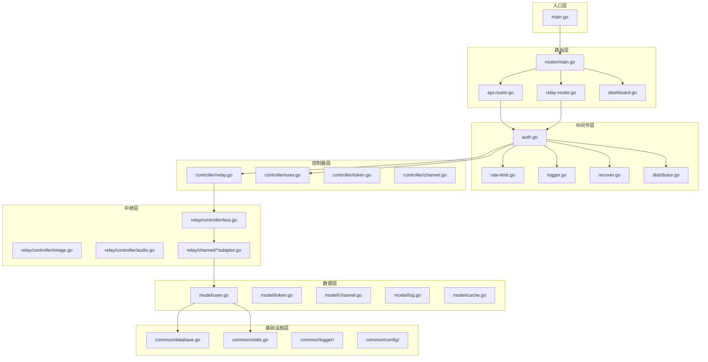
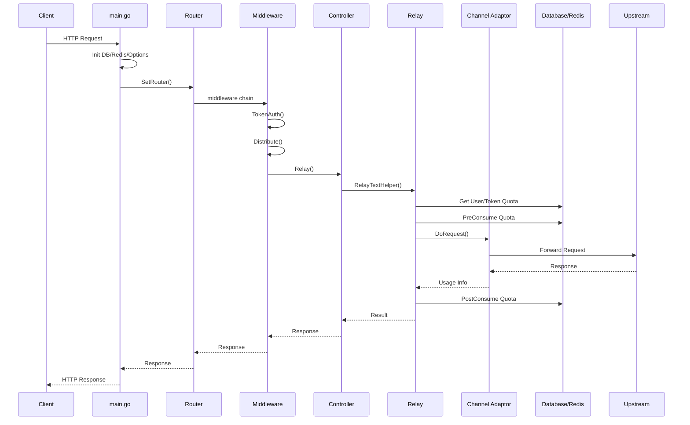
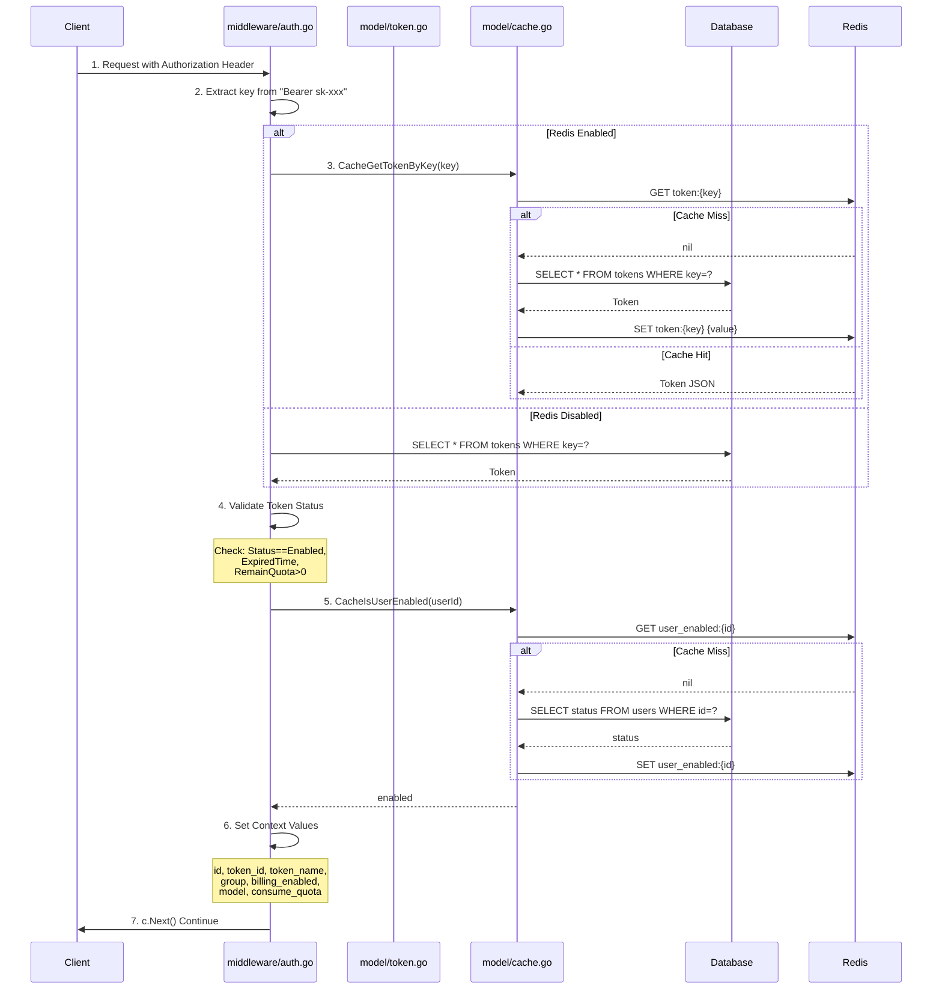
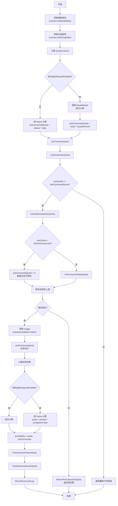
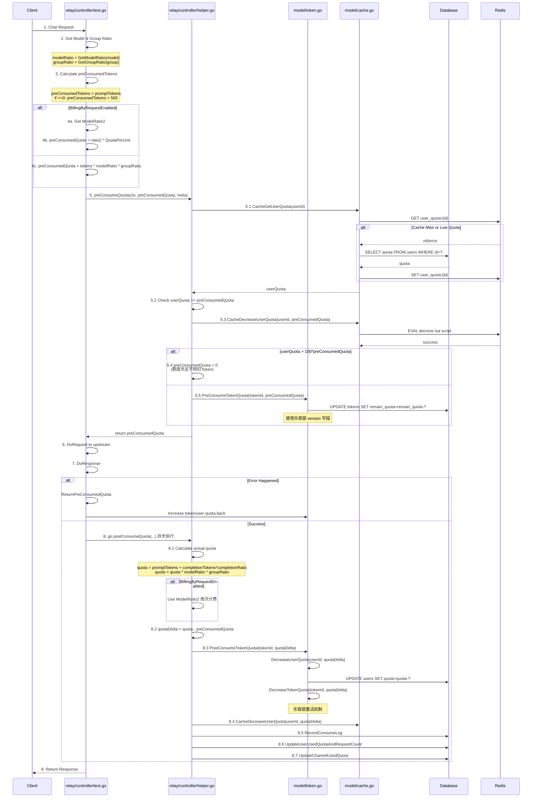
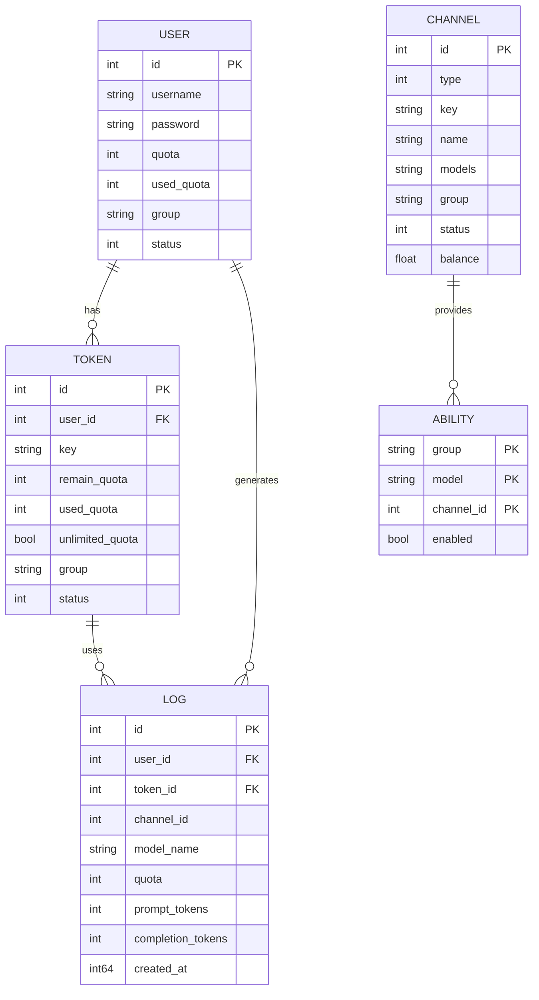
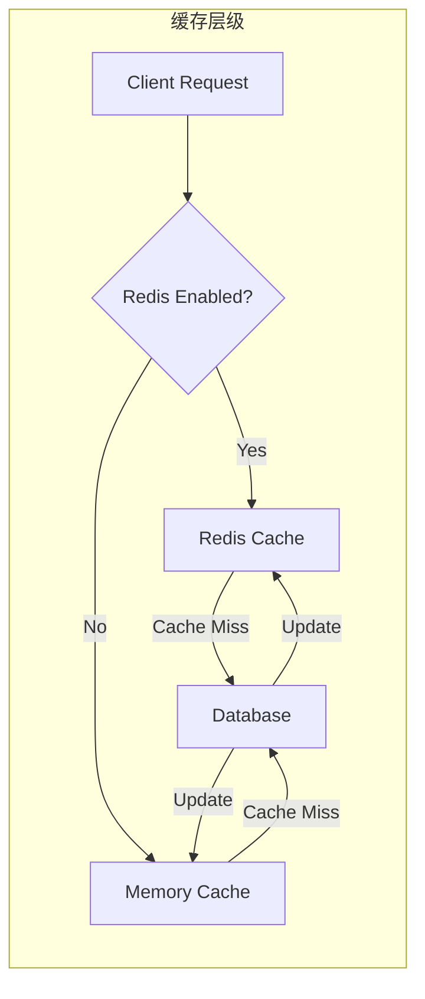
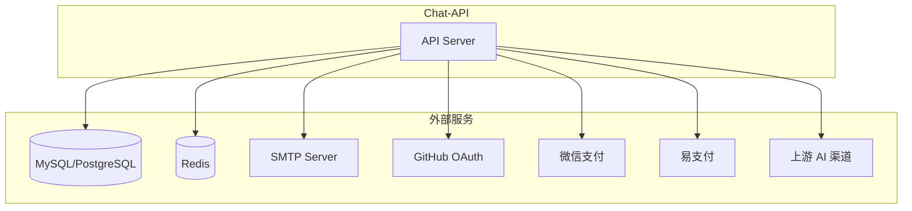
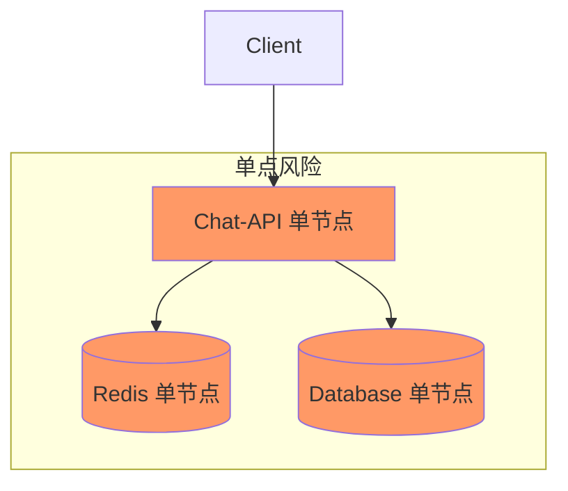

# Chat-API 项目架构分析报告

## 1. 项目整体架构

### 1.1 主要模块划分



### 1.2 关键文件位置

#### 入口文件
- **主入口**: [main.go](file:///f:/trae_project/chatapi/chat-api/main.go#L1-L140) - 程序初始化、数据库连接、Redis连接、路由设置

#### 路由注册位置
- **路由总入口**: [router/main.go](file:///f:/trae_project/chatapi/chat-api/router/main.go#L1-L14) - 汇总所有路由
- **API 路由**: [router/api-router.go](file:///f:/trae_project/chatapi/chat-api/router/api-router.go#L1-L200) - 用户管理、渠道管理、令牌管理等
- **中继路由**: [router/relay-router.go](file:///f:/trae_project/chatapi/chat-api/router/relay-router.go#L1-L100) - OpenAI API 转发路由
- **Dashboard 路由**: [router/dashboard.go](file:///f:/trae_project/chatapi/chat-api/router/dashboard.go) - 数据看板

#### 中间件位置
- **Token 鉴权**: [middleware/auth.go](file:///f:/trae_project/chatapi/chat-api/middleware/auth.go#L89-L283) - API Key 验证
- **用户会话鉴权**: [middleware/auth.go](file:///f:/trae_project/chatapi/chat-api/middleware/auth.go#L22-L81) - Cookie/Session 验证
- **限流**: [middleware/rate-limit.go](file:///f:/trae_project/chatapi/chat-api/middleware/rate-limit.go#L1-L100) - Redis/内存限流
- **日志**: [middleware/logger.go](file:///f:/trae_project/chatapi/chat-api/middleware/logger.go#L1-L25) - Gin 访问日志
- **错误恢复**: [middleware/recover.go](file:///f:/trae_project/chatapi/chat-api/middleware/recover.go#L1-L33) - Panic 捕获
- **渠道分发**: [middleware/distributor.go](file:///f:/trae_project/chatapi/chat-api/middleware/distributor.go#L17-L68) - 选择上游渠道

#### 核心业务处理位置
- **中继主控**: [controller/relay.go](file:///f:/trae_project/chatapi/chat-api/controller/relay.go#L26-L100) - 请求转发和重试
- **文本中继**: [relay/controller/text.go](file:///f:/trae_project/chatapi/chat-api/relay/controller/text.go#L1-L198) - 处理文本请求
- **计费辅助函数**: [relay/controller/helper.go](file:///f:/trae_project/chatapi/chat-api/relay/controller/helper.go#L188-L320) - 预扣费/后扣费逻辑
- **渠道适配器接口**: [relay/channel/interface.go](file:///f:/trae_project/chatapi/chat-api/relay/channel/interface.go) - 定义渠道适配接口

#### 数据模型位置
- **用户模型**: [model/user.go](file:///f:/trae_project/chatapi/chat-api/model/user.go#L1-L150) - User 结构体及操作
- **令牌模型**: [model/token.go](file:///f:/trae_project/chatapi/chat-api/model/token.go#L1-L312) - Token 结构体及额度操作
- **渠道模型**: [model/channel.go](file:///f:/trae_project/chatapi/chat-api/model/channel.go#L1-L150) - Channel 结构体
- **日志模型**: [model/log.go](file:///f:/trae_project/chatapi/chat-api/model/log.go#L1-L150) - 请求日志记录
- **缓存管理**: [model/cache.go](file:///f:/trae_project/chatapi/chat-api/model/cache.go#L1-L150) - Redis 缓存操作
- **数据库初始化**: [model/main.go](file:///f:/trae_project/chatapi/chat-api/model/main.go#L1-L150) - 数据库连接和迁移

### 1.3 模块调用关系



## 2. 关键功能实现位置

### 2.1 鉴权实现

| 功能 | 文件位置 | 关键函数 | 行号 |
|------|----------|----------|------|
| Token 鉴权 | middleware/auth.go | `TokenAuth()` | L89-L283 |
| 用户会话鉴权 | middleware/auth.go | `authHelper()` | L22-L81 |
| Token 验证 | model/token.go | `ValidateUserToken()` | L76-L127 |
| 用户额度检查 | model/cache.go | `CacheGetUserQuota()` | L77-L108 |

### 2.2 限流实现

| 功能 | 文件位置 | 关键函数 | 行号 |
|------|----------|----------|------|
| 全局 API 限流 | middleware/rate-limit.go | `GlobalAPIRateLimit()` | L74-L78 |
| Redis 限流 | middleware/rate-limit.go | `redisRateLimiter()` | L22-L64 |
| 内存限流 | middleware/rate-limit.go | `memoryRateLimiter()` | L66-L72 |

### 2.3 日志实现

| 功能 | 文件位置 | 关键函数 | 行号 |
|------|----------|----------|------|
| Gin 日志中间件 | middleware/logger.go | `SetUpLogger()` | L1-L25 |
| 业务日志 | common/logger/logger.go | `Info()`, `Error()` | L47-L95 |
| 消费日志记录 | model/log.go | `RecordConsumeLog()` | L147-L155 |

### 2.4 错误处理

| 功能 | 文件位置 | 关键函数 | 行号 |
|------|----------|----------|------|
| Panic 恢复 | middleware/recover.go | `RelayPanicRecover()` | L1-L33 |
| 全局错误处理 | main.go | `gin.CustomRecovery()` | L109-L117 |

### 2.5 业务转发

| 功能 | 文件位置 | 关键函数 | 行号 |
|------|----------|----------|------|
| 渠道分发 | middleware/distributor.go | `Distribute()` | L17-L68 |
| 选择渠道 | middleware/distributor.go | `selectChannelForUser()` | L56-L68 |
| 中继主控 | controller/relay.go | `Relay()` | L26-L100 |
| 重试逻辑 | controller/relay.go | 重试循环 | L46-L94 |

## 3. 核心业务逻辑分析

### 3.1 鉴权流程



**鉴权依赖**:
1. **Redis** (可选): 用于 Token 缓存，减少数据库查询
2. **Database**: 存储 Token、User 信息 (SQLite/MySQL/PostgreSQL)
3. **Gin Sessions**: 用于 Web 端用户登录态管理

### 3.2 计费流程

#### 计费流程图



#### 计费时序图



### 3.3 计费模块关键代码分析

#### 3.3.1 预扣费逻辑

**位置**: [relay/controller/helper.go](file:///f:/trae_project/chatapi/chat-api/relay/controller/helper.go#L188-L222)

```go
func preConsumeQuota(ctx context.Context, preConsumedQuota int, meta *util.RelayMeta) (int, *relaymodel.ErrorWithStatusCode) {
    // 1. 从缓存获取用户额度
    userQuota, err := model.CacheGetUserQuota(ctx, meta.UserId)
    
    // 2. 检查额度是否充足
    if userQuota-preConsumedQuota < 0 {
        return preConsumedQuota, openai.ErrorWrapper(errors.New("user quota is not enough"), ...)
    }
    
    // 3. 先扣减用户额度缓存
    err = model.CacheDecreaseUserQuota(ctx, meta.UserId, preConsumedQuota)
    
    // 4. 如果用户额度充足(>100倍预扣费)，不预扣Token额度
    if userQuota > 100*preConsumedQuota {
        preConsumedQuota = 0
    }
    
    // 5. 预扣Token额度
    if preConsumedQuota > 0 {
        err := model.PreConsumeTokenQuota(meta.TokenId, preConsumedQuota)
    }
    return preConsumedQuota, nil
}
```

#### 3.3.2 后扣费逻辑

**位置**: [relay/controller/helper.go](file:///f:/trae_project/chatapi/chat-api/relay/controller/helper.go#L224-L320)

```go
func postConsumeQuota(ctx context.Context, usage *relaymodel.Usage, meta *util.RelayMeta, ...) {
    // 1. 获取补全倍率
    completionRatio := common.GetCompletionRatio(textRequest.Model)
    
    // 2. 计算实际使用额度
    quota = promptTokens + int(float64(completionTokens)*completionRatio)
    quota = int(float64(quota) * ratio)
    
    // 3. 如果启用按次计费
    if BillingByRequestEnabled {
        modelRatio2, ok := common.GetModelRatio2(meta.OriginModelName)
        quota = int(ratio * config.QuotaPerUnit)
    }
    
    // 4. 计算差额
    quotaDelta := quota - preConsumedQuota
    
    // 5. 更新Token额度
    err = model.PostConsumeTokenQuota(meta.TokenId, quotaDelta)
    
    // 6. 更新用户额度缓存
    err = model.CacheDecreaseUserQuota(ctx, meta.UserId, quotaDelta)
    
    // 7. 记录日志
    model.RecordConsumeLog(...)
    model.UpdateUserUsedQuotaAndRequestCount(meta.UserId, quota)
    model.UpdateChannelUsedQuota(meta.ChannelId, quota)
}
```

#### 3.3.3 乐观锁扣费实现

**位置**: [model/token.go](file:///f:/trae_project/chatapi/chat-api/model/token.go#L203-L231)

```go
func decreaseTokenQuota(id int, quota int) error {
    maxRetries := 2
    for retries := 0; retries < maxRetries; retries++ {
        // 1. 获取当前Token信息和version
        DB.Select("id, remain_quota, used_quota, version").Where("id = ?", id).First(&token)
        
        newVersion := time.Now().UnixNano() / int64(time.Millisecond)
        
        // 2. 使用乐观锁更新，WHERE条件包含version
        result := DB.Model(&Token{}).
            Where("id = ? AND version = ?", id, token.Version).
            Updates(map[string]interface{}{
                "remain_quota":  gorm.Expr("remain_quota - ?", quota),
                "used_quota":    gorm.Expr("used_quota + ?", quota),
                "accessed_time": newVersion,
                "version":       newVersion,
            })
        
        // 3. 如果更新成功(RowsAffected==1)，返回
        if result.RowsAffected == 1 {
            return nil
        }
        
        // 4. 失败则重试
        time.Sleep(time.Millisecond * time.Duration(10*(retries+1)))
    }
    return errors.New("failed to update token quota after max retries")
}
```

### 3.4 计费模块潜在问题与修复建议

#### 问题 1: 预扣费逻辑不一致

**位置**: [relay/controller/helper.go](file:///f:/trae_project/chatapi/chat-api/relay/controller/helper.go#L208-L215)

**问题描述**:
```go
if userQuota > 100*preConsumedQuota {
    preConsumedQuota = 0  // 额度充足时不预扣Token额度
}
```

当用户额度大于100倍预扣费时，预扣费设为0，这会导致：
1. 请求失败后没有额度可以返还
2. 实际扣费时 `quotaDelta = quota - 0 = quota`，可能多扣费

**修复建议**:
```go
// 统一预扣费逻辑，无论额度多少都进行预扣
// 或者调整阈值逻辑，确保额度充足判断准确
const PreConsumeThreshold = 100
if userQuota > preConsumedQuota * PreConsumeThreshold {
    // 仍然预扣，但标记为可忽略
    logger.Info(ctx, "用户额度充足，预扣费可忽略")
}
```

#### 问题 2: 异步扣费失败无补偿

**位置**: [relay/controller/text.go](file:///f:/trae_project/chatapi/chat-api/relay/controller/text.go#L145)

**问题描述**:
```go
go postConsumeQuota(ctx, usage, meta, textRequest, ratio, preConsumedQuota, modelRatio, groupRatio, aitext, duration)
```

使用 goroutine 异步执行扣费，如果失败：
1. 错误只记录到日志
2. 没有重试机制
3. 用户额度与实际消费不一致

**修复建议**:
```go
// 方案1: 使用消息队列保证最终一致性
// 方案2: 添加重试和补偿机制
func postConsumeQuotaWithRetry(...) {
    for i := 0; i < 3; i++ {
        err := doPostConsumeQuota(...)
        if err == nil {
            return
        }
        time.Sleep(time.Second * time.Duration(i+1))
    }
    // 记录到补偿表，定时任务补偿
    recordCompensationLog(...)
}
```

#### 问题 3: 并发扣费竞争条件

**位置**: [model/token.go](file:///f:/trae_project/chatapi/chat-api/model/token.go#L203-L231)

**问题描述**:
乐观锁虽然能防止并发更新问题，但重试机制在高并发下：
1. 可能导致延迟增加
2. 极端情况下重试耗尽后扣费失败
3. 用户体验差

**修复建议**:
```go
// 方案1: 使用数据库行级锁
func decreaseTokenQuotaWithLock(id int, quota int) error {
    return DB.Transaction(func(tx *gorm.DB) error {
        var token Token
        // SELECT FOR UPDATE 锁定行
        if err := tx.Set("gorm:query_option", "FOR UPDATE").First(&token, id).Error; err != nil {
            return err
        }
        return tx.Model(&token).Updates(map[string]interface{}{
            "remain_quota": gorm.Expr("remain_quota - ?", quota),
            "used_quota":   gorm.Expr("used_quota + ?", quota),
        }).Error
    })
}

// 方案2: 使用 Redis 原子操作预扣费
func PreConsumeWithRedis(tokenId int, quota int) error {
    key := fmt.Sprintf("token_quota:%d", tokenId)
    result := RedisDecrBy(key, quota)
    if result < 0 {
        RedisIncrBy(key, quota) // 回滚
        return errors.New("quota insufficient")
    }
    return nil
}
```

#### 问题 4: 额度缓存不一致风险

**位置**: [model/cache.go](file:///f:/trae_project/chatapi/chat-api/model/cache.go#L110-L140)

**问题描述**:
```go
func CacheDecreaseUserQuota(ctx context.Context, id int, quota int) error {
    if !common.RedisEnabled {
        return nil  // Redis未启用时不扣减
    }
    // ...
}
```

当 Redis 未启用时，直接返回 nil，但数据库额度已扣减，导致缓存和数据库不一致。

**修复建议**:
```go
func CacheDecreaseUserQuota(ctx context.Context, id int, quota int) error {
    if !common.RedisEnabled {
        // 直接操作数据库或返回错误
        return decreaseUserQuotaDirectly(id, quota)
    }
    // ...
}
```

## 4. 数据库、缓存和外部服务

### 4.1 数据库



| 类型 | 支持情况 | 配置方式 | 文件位置 |
|------|----------|----------|----------|
| **SQLite** | 默认 | 无需配置 | [model/main.go](file:///f:/trae_project/chatapi/chat-api/model/main.go#L55-L58) |
| **MySQL** | 支持 | `SQL_DSN` 环境变量 | [model/main.go](file:///f:/trae_project/chatapi/chat-api/model/main.go#L47-L54) |
| **PostgreSQL** | 支持 | `SQL_DSN` (postgres://) | [model/main.go](file:///f:/trae_project/chatapi/chat-api/model/main.go#L40-L46) |

### 4.2 缓存



| 类型 | 用途 | 位置 | Key 格式 |
|------|------|------|----------|
| **Redis** | Token 缓存 | [model/cache.go](file:///f:/trae_project/chatapi/chat-api/model/cache.go#L26-L50) | `token:{key}` |
| **Redis** | 用户额度缓存 | [model/cache.go](file:///f:/trae_project/chatapi/chat-api/model/cache.go#L77-L108) | `user_quota:{id}` |
| **Redis** | 用户分组缓存 | [model/cache.go](file:///f:/trae_project/chatapi/chat-api/model/cache.go#L52-L75) | `user_group:{id}` |
| **Redis** | 限流计数 | [middleware/rate-limit.go](file:///f:/trae_project/chatapi/chat-api/middleware/rate-limit.go#L22-L64) | `rateLimit:{mark}{ip}` |
| **内存** | 渠道缓存 | [model/cache.go](file:///f:/trae_project/chatapi/chat-api/model/cache.go#L180-L220) | `group2model2channels` |

### 4.3 外部服务



| 服务类型 | 用途 | 配置项 | 文件位置 |
|----------|------|--------|----------|
| **SMTP** | 邮件通知 | `SMTPServer`, `SMTPPort`, `SMTPAccount` | [common/config/config.go](file:///f:/trae_project/chatapi/chat-api/common/config/config.go#L75-L79) |
| **GitHub OAuth** | 第三方登录 | `GitHubClientId`, `GitHubClientSecret` | [common/config/config.go](file:///f:/trae_project/chatapi/chat-api/common/config/config.go#L83-L84) |
| **微信支付** | 充值 | `WeChatServerAddress`, `WeChatServerToken` | [common/config/config.go](file:///f:/trae_project/chatapi/chat-api/common/config/config.go#L86-L88) |
| **易支付** | 在线支付 | `EpayId`, `EpayKey`, `PayAddress` | [common/config/config.go](file:///f:/trae_project/chatapi/chat-api/common/config/config.go#L19-L21) |
| **Turnstile** | 人机验证 | `TurnstileSiteKey`, `TurnstileSecretKey` | [common/config/config.go](file:///f:/trae_project/chatapi/chat-api/common/config/config.go#L90-L91) |
| **上游渠道** | AI 模型服务 | Channel 配置 | [model/channel.go](file:///f:/trae_project/chatapi/chat-api/model/channel.go#L1-L150) |

## 5. 潜在风险与可维护性问题

### 5.1 代码层面风险

#### 风险 1: 全局变量过多

**位置**: [common/config/config.go](file:///f:/trae_project/chatapi/chat-api/common/config/config.go#L12-L100)

**问题描述**:
```go
var (
    SystemName = "Chat API"
    ServerAddress = "http://localhost:3000"
    // ... 50+ 全局变量
)
```

**影响**:
- 并发安全问题
- 测试困难
- 代码耦合度高

**修复建议**:
```go
// 使用依赖注入模式
type Config struct {
    SystemName    string
    ServerAddress string
    // ...
}

func NewConfig() *Config {
    return &Config{
        SystemName:    getEnv("SYSTEM_NAME", "Chat API"),
        ServerAddress: getEnv("SERVER_ADDRESS", "http://localhost:3000"),
    }
}
```

#### 风险 2: 错误处理不一致

**位置**: 多个文件

**问题描述**:
- 有些使用 `log.Println`，有些使用自定义 logger
- 有些错误被吞掉（`_ = something()`）
- 错误信息格式不统一

**修复建议**:
1. 统一使用 [common/logger/logger.go](file:///f:/trae_project/chatapi/chat-api/common/logger/logger.go) 进行日志记录
2. 所有错误都应该被处理或显式忽略并注释原因
3. 定义错误码规范

#### 风险 3: 数据库连接池配置可能不合理

**位置**: [model/main.go](file:///f:/trae_project/chatapi/chat-api/model/main.go#L45-L50)

```go
sqlDB.SetMaxIdleConns(common.GetOrDefault("SQL_MAX_IDLE_CONNS", 100))
sqlDB.SetMaxOpenConns(common.GetOrDefault("SQL_MAX_OPEN_CONNS", 1000))
```

**修复建议**:
1. 根据实际负载测试调整默认配置
2. 添加连接池监控和告警
3. 支持动态调整

### 5.2 架构层面风险

#### 风险 4: 单点故障



**修复建议**:
1. 支持多节点部署（已实现 `NODE_TYPE` 环境变量）
2. 使用 Redis Cluster 或 Sentinel
3. 数据库主从复制
4. 考虑引入 Kubernetes 或服务网格

#### 风险 5: 缺乏熔断和降级机制

**位置**: [controller/relay.go](file:///f:/trae_project/chatapi/chat-api/controller/relay.go#L46-L94)

**问题描述**:
当上游渠道故障时，虽然有重试机制，但没有熔断，故障渠道可能被重复尝试。

**修复建议**:
```go
// 实现熔断器模式
type CircuitBreaker struct {
    failureCount int
    lastFailureTime time.Time
    state State // CLOSED, OPEN, HALF_OPEN
}

func (cb *CircuitBreaker) Call(fn func() error) error {
    if cb.state == OPEN {
        if time.Since(cb.lastFailureTime) > timeout {
            cb.state = HALF_OPEN
        } else {
            return errors.New("circuit breaker is open")
        }
    }
    
    err := fn()
    if err != nil {
        cb.recordFailure()
        return err
    }
    
    cb.recordSuccess()
    return nil
}
```

### 5.3 安全层面风险

#### 风险 6: Token 密钥存储和传输

**位置**: [middleware/auth.go](file:///f:/trae_project/chatapi/chat-api/middleware/auth.go#L89-L283)

**问题描述**:
1. Token 密钥以明文形式存储在数据库
2. 密钥在 Header 中传输

**修复建议**:
1. 考虑使用 JWT 替代长期有效的 API Key
2. 添加密钥轮换机制
3. 实现 IP 白名单功能（已实现 `Subnet` 字段）

#### 风险 7: 缺乏请求内容校验

**位置**: [relay/controller/text.go](file:///f:/trae_project/chatapi/chat-api/relay/controller/text.go#L1-L198)

**修复建议**:
1. 添加请求大小限制
2. 对消息内容进行敏感词过滤
3. 实现请求参数校验中间件

### 5.4 可维护性问题

#### 问题 8: 代码重复

**位置**: 多个 channel 适配器

**修复建议**:
1. 提取公共逻辑到基类或工具函数
2. 使用代码生成减少重复

#### 问题 9: 缺乏单元测试

**修复建议**:
1. 为核心业务逻辑添加单元测试
2. 使用 mock 测试数据库和外部服务交互
3. 添加集成测试

#### 问题 10: 配置管理混乱

**修复建议**:
1. 统一配置管理，使用配置中心（如 Consul、Etcd）
2. 区分静态配置和动态配置
3. 提供配置热更新能力

---

## 附录：关键依赖

| 依赖 | 用途 | 版本 |
|------|------|------|
| `github.com/gin-gonic/gin` | Web 框架 | v1.9+ |
| `gorm.io/gorm` | ORM | v1.25+ |
| `github.com/go-redis/redis/v8` | Redis 客户端 | v8.11+ |
| `github.com/gin-contrib/sessions` | Session 管理 | - |
| `github.com/gorilla/websocket` | WebSocket 支持 | v1.5+ |
| `github.com/pkoukk/tiktoken-go` | Token 计算 | - |
| `github.com/joho/godotenv` | 环境变量加载 | v1.4+ |
