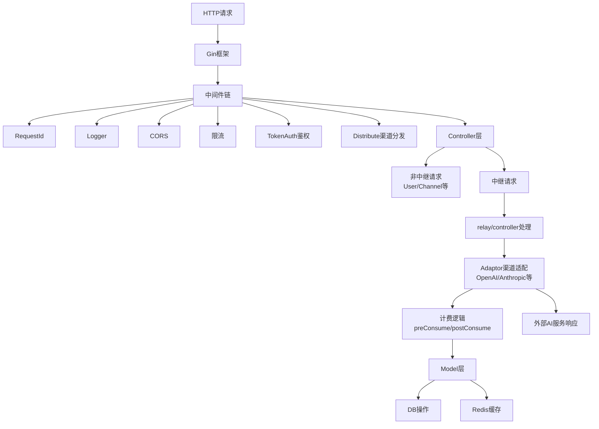
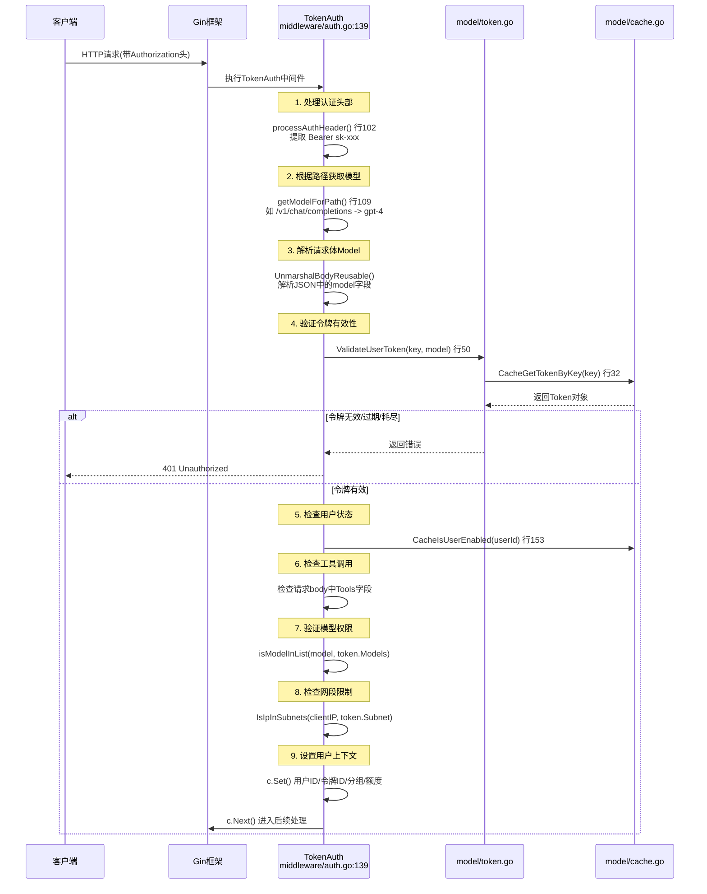
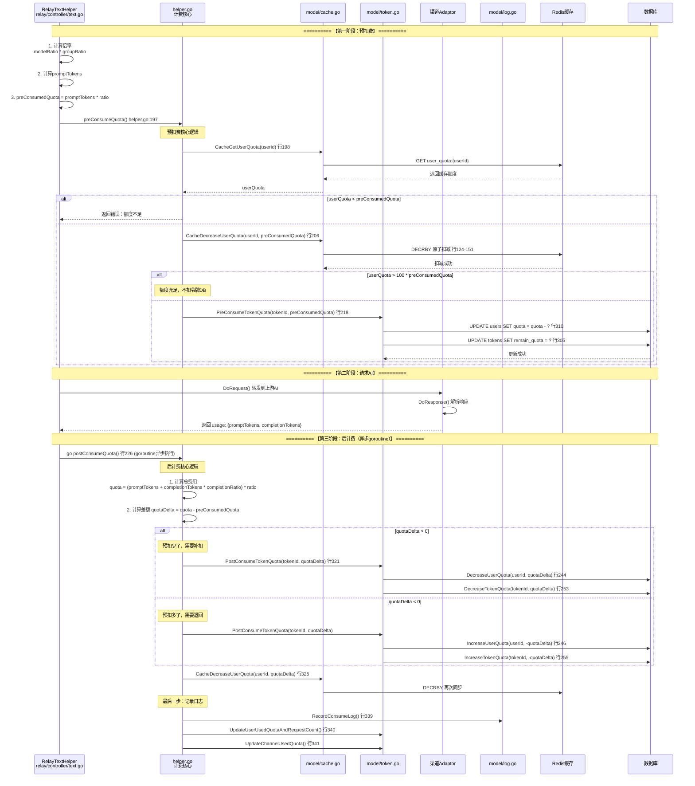
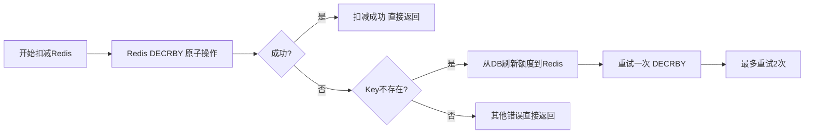

# Chat API 项目架构分析报告

## 1. 项目整体架构

### 1.1 主要模块划分

项目采用典型的 Go Web 项目分层架构，主要分为以下模块：

| 模块名称 | 目录位置 | 主要职责 |
|---------|---------|---------|
| 主入口 | `/` | 程序启动、初始化、依赖注入 |
| 通用工具层 | `/common/` | 配置、日志、数据库、Redis、加密、工具函数 |
| 中间件层 | `/middleware/` | 鉴权、限流、CORS、日志、错误恢复、请求分发 |
| 控制层 | `/controller/` | HTTP 请求处理、业务逻辑入口 |
| 数据模型层 | `/model/` | 数据库实体、ORM、数据访问层 |
| 中继转发层 | `/relay/` | AI 渠道适配、请求转发、响应处理 |
| 路由层 | `/router/` | 路由注册、请求分发 |
| 支付模块 | `/epay/` | 支付处理、订单管理 |
| 国际化 | `/i18n/` | 多语言支持 |

### 1.2 关键文件位置

#### 出入口文件
- **主入口文件**：`main.go:25-139` - 程序启动入口
- **初始化函数**：`main.go:39-52` - 数据库、Redis初始化

#### 路由注册位置
- **主路由入口**：`router/main.go:9-13` - `SetRouter()` 函数
- **API 路由**：`router/api-router.go:11-171` - `SetApiRouter()`
- **中继路由**：`router/relay-router.go:32-114` - `SetRelayRouter()`

#### 中间件位置
- 目录：`/middleware/`
  - `auth.go:28-282` - 鉴权中间件
  - `rate-limit.go:16-103` - 限流中间件
  - `logger.go:9-24` - 访问日志
  - `recover.go:12-32` - Panic 恢复
  - `distributor.go:19-148` - 渠道分发
  - `cors.go` - 跨域处理

#### 核心业务处理位置
- **API 业务**：`/controller/` 目录下各文件
- **中继转发**：`controller/relay.go:45-135` - `Relay()` 主入口
- **计费逻辑**：`relay/controller/text.go:24-174` - `RelayTextHelper()`
- **渠道选择**：`middleware/distributor.go:75-94` - `selectChannelForUser()`

#### 数据模型位置
- 目录：`/model/`
  - `user.go:19-44` - 用户模型
  - `token.go:15-33` - 令牌模型
  - `channel.go` - 渠道模型
  - `log.go:14-35` - 日志模型
  - `main.go:16-175` - 数据库初始化

### 1.3 模块调用关系



调用流程说明：
1. 所有请求先经过中间件链处理
2. TokenAuth 验证用户令牌，设置用户上下文
3. Distributor 选择合适的渠道
4. Controller 处理具体业务逻辑
5. 中继请求调用对应渠道的 Adaptor 进行格式转换
6. 计费逻辑在请求前后进行额度处理
7. Model 层进行持久化操作

---

## 2. 关键步骤实现文件

| 功能 | 文件位置 | 关键函数/行号 |
|------|---------|-------------|
| **鉴权** | `middleware/auth.go:28-282` | `TokenAuth()` 行139 |
| | `model/token.go:50-104` | `ValidateUserToken()` 行50 |
| | `middleware/auth.go:28-81` | `authHelper()` 行28 |
| **限流** | `middleware/rate-limit.go:16-103` | `redisRateLimiter()` 行16 |
| | | `GlobalAPIRateLimit()` 行89 |
| | | `CriticalRateLimit()` 行93 |
| **日志** | `middleware/logger.go:9-24` | `SetUpLogger()` 行9 |
| | `common/logger/` | 日志框架实现 |
| | `model/log.go:14-99` | 日志数据模型 |
| **错误处理** | `middleware/recover.go:12-32` | `RelayPanicRecover()` 行12 |
| | `main.go:113-121` | Gin 全局 Recovery |
| | `relay/util/common.go` | `RelayErrorHandler()` |
| **业务转发** | `controller/relay.go:45-135` | `Relay()` 行45 |
| | `relay/controller/text.go:24-174` | `RelayTextHelper()` 行24 |
| | `middleware/distributor.go:19-44` | `Distribute()` 行19 |
| | `relay/channel/*/main.go` | 各渠道具体实现 |

---

## 3. 核心业务逻辑分析

### 3.1 鉴权流程分析

#### Mermaid 时序图



#### 鉴权依赖

1. **数据库依赖**：
   - GORM ORM 框架 `model/main.go`
   - Token 表查询 `model/token.go:50`
   - User 状态校验 `model/user.go`

2. **缓存依赖**：
   - Redis 令牌缓存 `model/cache.go`
   - `CacheGetTokenByKey()` 函数

3. **加密依赖**：
   - `common/crypto.go` - 密码哈希
   - Session 存储 `github.com/gin-contrib/sessions`

---

### 3.2 计费流程分析（完整版）

#### 3.2.1 计费总览时序图



#### 3.2.2 计费核心流程图

```mermaid
flowchart TD
    A[开始计费] --> B[计算倍率]
    B --> B1[modelRatio = GetModelRatio(model)]
    B --> B2[groupRatio = GetGroupRatio(group)]
    B --> B3[ratio = modelRatio * groupRatio]
    
    A --> C[计算预扣费]
    C --> C1[promptTokens = CountMessagesTokens()]
    C --> C2[preConsumedQuota = promptTokens * ratio]
    C --> C3{按次计费?}
    C3 -->|是| C4[按次计算 fixedQuota]
    C3 -->|否| D
    
    D[执行预扣费] --> D1[Redis GET user_quota]
    D1 --> D2{额度足够?}
    D2 -->|否| Z[返回错误：额度不足]
    D2 -->|是| D3[Redis DECRBY 原子扣减]
    D3 --> D4{额度>100倍预扣费?}
    D4 -->|是| E[跳过DB扣减，性能优化]
    D4 -->|否| D5[DB UPDATE users SET quota = quota - ?]
    D5 --> D6[DB UPDATE tokens SET remain_quota = ?]
    
    E --> F[请求上游AI服务]
    F --> G[解析响应获取completionTokens]
    
    H[执行后计费 异步goroutine] --> H1[completionRatio = GetCompletionRatio()]
    H1 --> H2[actualQuota = (prompt + completion * completionRatio) * ratio]
    H2 --> H3[quotaDelta = actualQuota - preConsumedQuota]
    
    H3 --> I{quotaDelta > 0?}
    I -->|是| I1[补扣：Redis & DB 减少额度]
    I -->|否| J{quotaDelta < 0?}
    J -->|是| J1[退回：Redis & DB 增加额度]
    J -->|否| K[额度刚好相等]
    
    I1 --> L
    J1 --> L
    K --> L[记录消费日志Log表]
    L --> M[更新用户已用额度统计]
    M --> N[更新渠道使用统计]
    N --> O[计费结束]
```

#### 3.2.3 关键计费环节详解

##### 📌 1. 预扣费 - preConsumeQuota() `relay/controller/helper.go:197-224`

| 步骤 | 代码位置 | 说明 |
|------|---------|------|
| Redis查额度 | `helper.go:198` | `CacheGetUserQuota(ctx, userId)` |
| Redis扣减 | `helper.go:206` | `CacheDecreaseUserQuota(ctx, userId, preConsumedQuota)` |
| 性能优化 | `helper.go:210-215` | **额度 > 100×预扣费** 时，跳过DB扣减！ |
| DB扣令牌 | `helper.go:218` | `PreConsumeTokenQuota(tokenId, preConsumedQuota)` |

**关键优化说明**：
```go
// helper.go:210-215 行
if userQuota > 100*preConsumedQuota {
    preConsumedQuota = 0  // 标记为无需回滚
    // 用户额度充足，只扣Redis不扣DB！！！
    // 大幅减少DB写入，牺牲一点实时一致性换取性能
}
```

##### 📌 2. Redis 原子扣减 - CacheDecreaseUserQuota() `model/cache.go:124-151`



**代码实现**：使用 Lua 脚本保证原子性 `common/redis.go:70-84`
```lua
-- 原子扣减脚本
local current = redis.call('GET', KEYS[1])
if not current then return -1 end
redis.call('DECRBY', KEYS[1], ARGV[1])
return 0
```

##### 📌 3. 数据库预扣费 - PreConsumeTokenQuota() `model/token.go:264-312`

| 步骤 | 行号 | 说明 |
|------|------|------|
| 令牌检查 | 272-274 | 检查令牌剩余额度 |
| 用户检查 | 275-281 | 检查用户剩余额度 |
| 额度提醒 | 282-303 | 低于阈值时异步发邮件提醒 |
| 令牌扣减 | 305 | `DecreaseTokenQuota()` 乐观锁重试 |
| 用户扣减 | 310 | `DecreaseUserQuota()` 乐观锁重试 |

##### 📌 4. 多退少补 - quotaDelta 计算 `helper.go:274-313`

```go
// 完成公式 helper.go:274-280
completionRatio := common.GetCompletionRatio(textRequest.Model)
quota = promptTokens + int(float64(completionTokens) * completionRatio)
quota = int(float64(quota) * ratio)
quotaDelta := quota - preConsumedQuota  // 计算差额！！！

// quotaDelta > 0 → 预扣少了，需要补扣
// quotaDelta < 0 → 预扣多了，需要退回
// quotaDelta = 0 → 刚刚好
```

##### 📌 5. 后计费 - PostConsumeTokenQuota() `model/token.go:241-262`

| quotaDelta 符号 | 操作 | 调用函数 |
|---------------|------|---------|
| ✅ > 0 补扣 | 减少用户额度 | `DecreaseUserQuota(userId, quota)` |
| | 减少令牌额度 | `DecreaseTokenQuota(tokenId, quota)` |
| ✅ < 0 退回 | 增加用户额度 | `IncreaseUserQuota(userId, -quota)` |
| | 增加令牌额度 | `IncreaseTokenQuota(tokenId, -quota)` |

##### 📌 6. 异常情况回滚 `relay/util/billing.go:9-19`

请求失败时的额度回滚：
```go
func ReturnPreConsumedQuota(ctx, preConsumedQuota, tokenId) {
    if preConsumedQuota != 0 {
        go func() {
            // 注意：这里只回滚了DB，没有回滚Redis！！！
            PostConsumeTokenQuota(tokenId, -preConsumedQuota)
        }()
    }
}
```

---

### 3.3 计费模块潜在不足

#### 问题1：Redis 与 DB 一致性问题

**位置**：`relay/util/billing.go:13` 异常回滚时只更新了 DB，没有同步 Redis

**问题描述**：
请求失败回滚时，`ReturnPreConsumedQuota()` 只调用了 `PostConsumeTokenQuota()` 更新 DB，但 Redis 中扣减的额度没有回滚。这会导致：
- 缓存中的用户额度持续低于真实额度
- 严重时会出现"明明还有额度但提示不足"
- 直到 TTL 过期（默认 10 分钟）后才恢复

**代码位置证据**：
```go
// relay/util/billing.go:9-19
func ReturnPreConsumedQuota(...) {
    go func() {
        // 只更新了DB！！！没有调用 CacheDecreaseUserQuota() 回滚Redis
        err := model.PostConsumeTokenQuota(tokenId, -preConsumedQuota)
    }()
}
```

**修复建议**：
```go
func ReturnPreConsumedQuota(ctx, preConsumedQuota, tokenId, userId) {
    if preConsumedQuota != 0 {
        go func() {
            // 1. 回滚DB
            err := model.PostConsumeTokenQuota(tokenId, -preConsumedQuota)
            // 2. 新增：同步回滚Redis
            _ = model.CacheDecreaseUserQuota(ctx, userId, -preConsumedQuota)
        }()
    }
}
```

#### 问题2：大额度用户 DB 长期不更新问题

**位置**：`relay/controller/helper.go:210-215`

**问题描述**：
额度 > 100×预扣费 时跳过 DB 扣减，只扣 Redis。虽然性能好，但：
- 如果服务重启或 Redis 数据丢失，这部分已消费的额度将"消失"
- 用户相当于免费使用了这部分额度
- 这是一致性换性能的权衡，但风险较大

**修复建议**：
- 增加定时对账任务，每 N 分钟从 Redis 将消费额度刷回 DB
- 增加最大跳过扣减金额上限

#### 问题3：重试风暴与并发超卖问题

**位置**：`model/token.go:234-236` 乐观锁重试机制

**问题描述**：
```go
// DecreaseTokenQuota 采用乐观锁+重试
time.Sleep(time.Millisecond * time.Duration(10*(retries+1)))
```
高并发下大量请求同时重试会导致：
- 重试时间指数退避但基数太小
- 重试风暴导致数据库连接耗尽

**修复建议**：
- 增加最大重试次数（目前没有上限）
- 随机化退避时间增加抖动
- 超过重试次数直接返回失败而非无限等待

#### 问题4：Redis扣减后DB失败不一致

**位置**：`helper.go:218` 顺序问题

**问题描述**：
当前顺序：Redis 先扣 → DB 后扣。如果 Redis 成功但 DB 失败：
- 用户看到的额度是 DB 值（偏高）
- 但缓存中额度已经减少了
- 两者不一致直到缓存过期

**修复建议**：
改为"DB先扣成功再扣Redis"的最终一致模式，或增加补偿机制。

---

## 4. 数据库、缓存与外部服务

### 4.1 数据库

#### 支持的数据库类型 (`model/main.go:41-75`)

1. **SQLite** (默认)
   - 文件位置：`one-api.db`
   - 配置：`common/database.go:3`
   - 特性：无需额外服务，适合单机部署

2. **MySQL**
   - 触发条件：`SQL_DSN` 环境变量非 postgres 开头
   - 自动追加 `parseTime=true` 参数 `model/main.go:58-64`

3. **PostgreSQL**
   - 触发条件：`SQL_DSN` 以 `postgres://` 开头

#### 连接池配置 (`model/main.go:88-90`)
```go
MaxIdleConns:   100 (可通过 SQL_MAX_IDLE_CONNS 配置)
MaxOpenConns:   1000 (可通过 SQL_MAX_OPEN_CONNS 配置)
ConnMaxLifetime: 60分钟
```

#### 主要数据表
- `users` - 用户表 `model/user.go:19-44`
- `tokens` - 令牌表 `model/token.go:15-33`
- `channels` - 渠道表
- `logs` - 使用日志表 `model/log.go:14-35`
- `options` - 系统配置表
- `redemptions` - 兑换码表
- `abilities` - 模型能力表

### 4.2 缓存系统 (`common/redis.go:1-99`)

**Redis 缓存**
- 启用条件：`REDIS_CONN_STRING` 和 `SYNC_FREQUENCY` 环境变量均设置
- 客户端：`go-redis/redis/v8`
- 主要用途：
  1. 令牌缓存 `model/cache.go`
  2. 渠道缓存
  3. 限流计数器 `middleware/rate-limit.go:16-60`
  4. **用户额度分布式扣减（计费核心）**

**内存缓存**
- 启用条件：`MEMORY_CACHE_ENABLED=true`
- 实现：`common/rate-limit.go` 内存限流器
- 特点：高性能，但是无法分布式一致

### 4.3 外部服务

1. **AI 提供商服务**
   - OpenAI/Azure OpenAI
   - Anthropic Claude
   - Google Gemini/Palm
   - 百度文心一言
   - 阿里通义千问
   - 智谱 AI
   - 讯飞星火
   - Midjourney
   - 其他 20+ 渠道 (`/relay/channel/` 目录)

2. **OAuth 服务**
   - GitHub `controller/github.go`
   - 微信 `controller/wechat.go`

3. **支付服务**
   - 易支付 `epay/client.go`
   - WxPusher 推送 `controller/wxpusher.go`

4. **邮件服务**
   - SMTP 邮件验证 `common/email.go`
   - 额度提醒邮件

---

## 5. 潜在风险与可维护性问题

### 5.1 安全风险

#### 风险1：并发竞态条件

**位置**：`model/token.go:272-281` 预扣费检查

**问题**：检查 `token.RemainQuota < quota` 和实际扣减不是原子操作

**修复建议**：将检查移入 UPDATE 语句，利用数据库原子性：
```go
result := DB.Exec("UPDATE tokens SET remain_quota = remain_quota - ? 
                   WHERE id = ? AND remain_quota >= ?",
    amount, tokenId, amount)
if result.RowsAffected == 0 {
    return errors.New("额度不足")
}
```

### 5.2 性能问题

#### 问题1：重试时渠道查询 N+1

**位置**：`controller/relay.go:89` 循环重试时查询渠道

**问题**：每次重试都进行一次数据库查询

**修复建议**：
- 预热可用渠道列表到内存
- 批量获取渠道信息

#### 问题2：日志写入压力

**位置**：`relay/controller/text.go:172` 异步写日志

**问题**：高 QPS 下日志写入成为数据库瓶颈

**修复建议**：
- 使用 Redis List 作为日志缓冲
- 批量写入数据库
- 冷热数据分离

### 5.3 可维护性问题

#### 问题1：错误处理不一致

**位置**：项目各处错误处理风格不统一

**现象**：
- 有的地方直接 `c.Abort()`
- 有的地方返回 `error`
- 有的地方只打日志不返回

**修复建议**：
- 统一错误码规范
- 统一错误处理中间件

#### 问题2：计费流程注释缺失

**位置**：`relay/controller/helper.go:197-344`

**现象**：100多行的核心计费函数，关键分支几乎无注释
- "100倍预扣费"性能优化完全没有文档说明
- quotaDelta 多退少补逻辑没有注释

**修复建议**：给核心计费分支增加设计意图说明

---

## 总结

Chat API 项目是一个架构清晰的 AI 网关系统，采用经典的 MVC 分层架构，具备完整的鉴权、限流、计费、渠道管理功能。

**计费设计亮点**：
1. ✅ Redis 原子扣减 + Lua 脚本保证并发安全
2. ✅ "预扣+后算+多退少补"架构保证请求性能
3. ✅ 大额度用户跳过 DB 的性能优化
4. ✅ 乐观锁重试保证 DB 一致性

**需要关注的问题**：
1. ⚠️ Redis 与 DB 的一致性问题（异常回滚时漏更Redis）
2. ⚠️ 大额度用户的对账机制缺失
3. ⚠️ 核心计费逻辑注释不足

整体设计成熟，考虑了高并发、多租户、多渠道场景，适合作为 AI 服务的统一接入层。
