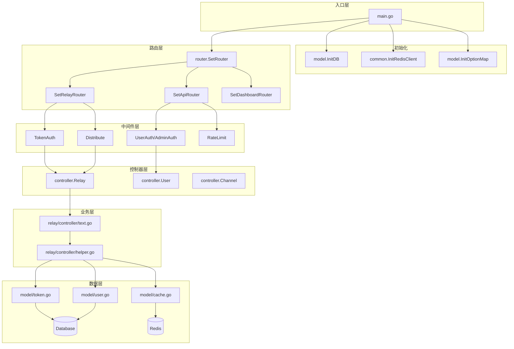
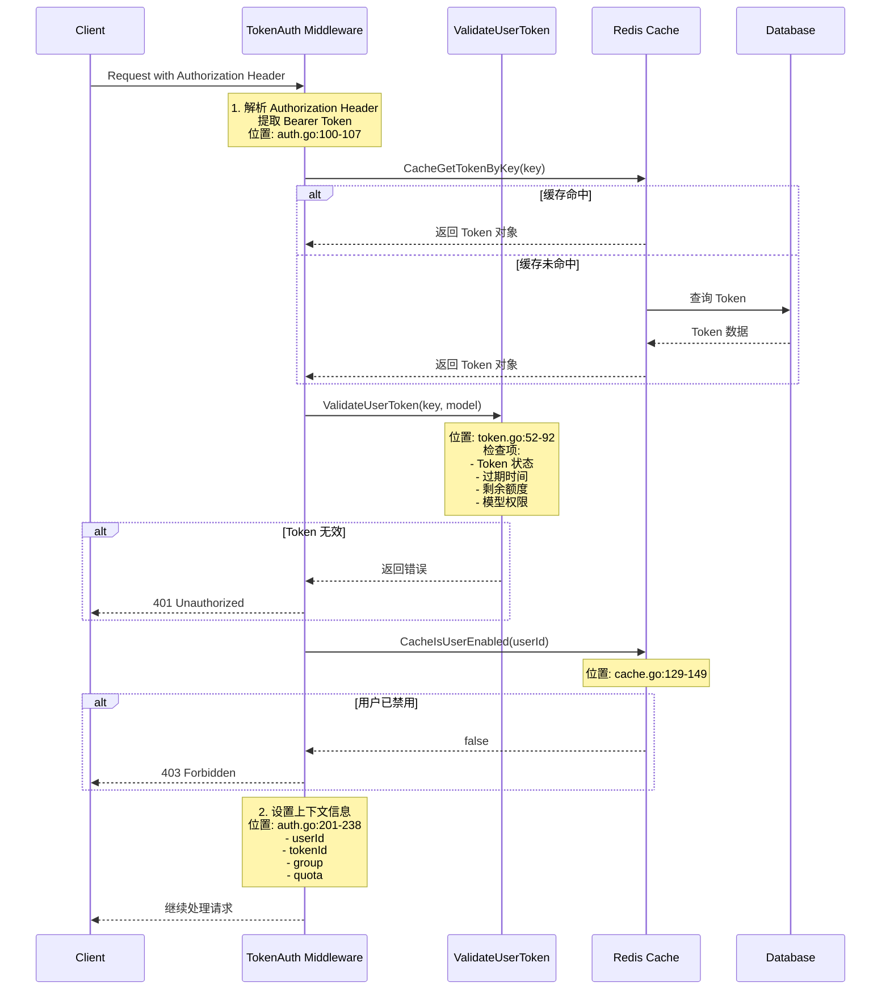
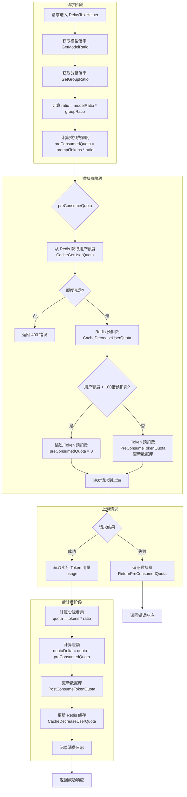
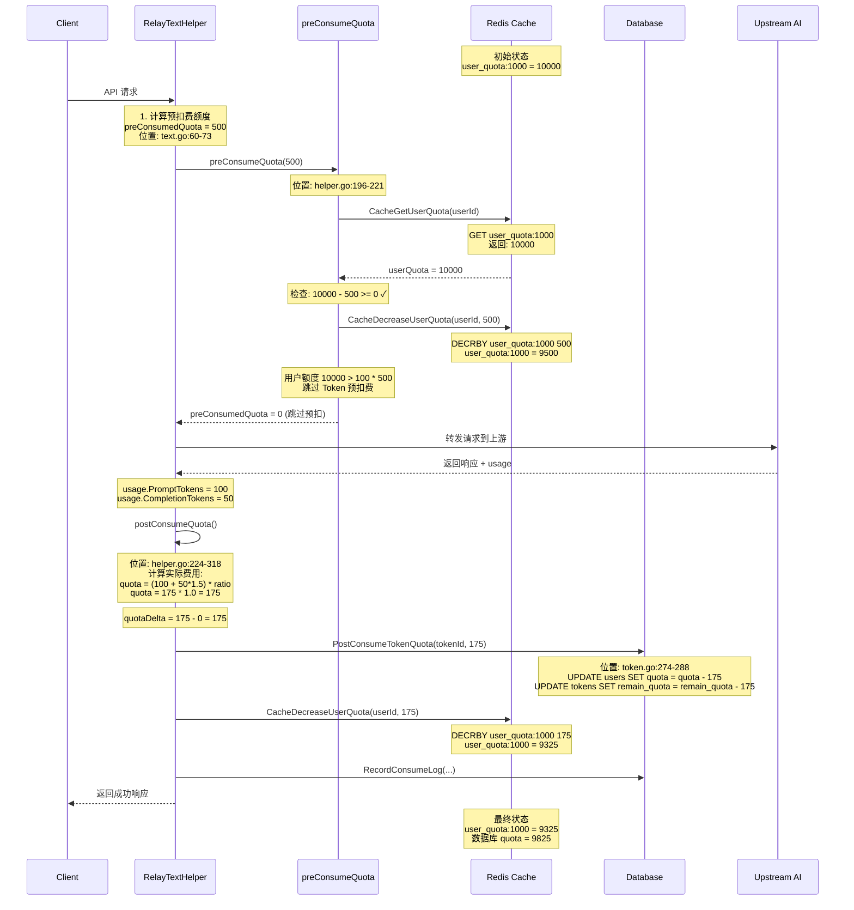
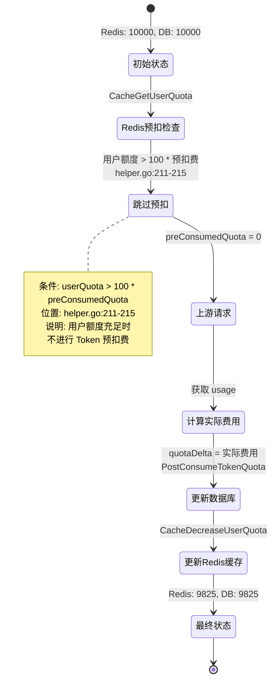
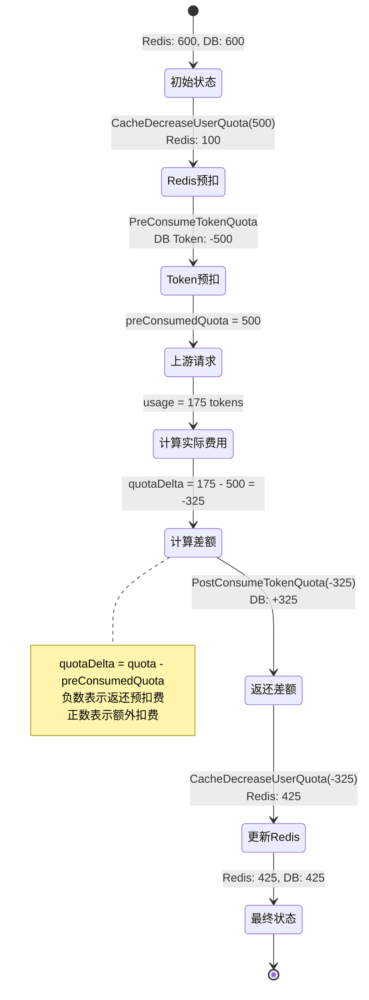

# Chat API 项目分析报告

## 1. 项目整体架构

### 1.1 主要模块划分

项目采用经典的 Go Web 应用分层架构，主要模块如下：

| 模块 | 路径 | 职责 |
|------|------|------|
| **入口模块** | `main.go` | 应用启动、初始化数据库/Redis、配置路由 |
| **路由模块** | `router/` | 定义 API 路由规则 |
| **中间件模块** | `middleware/` | 鉴权、限流、日志、跨域等横切关注点 |
| **控制器模块** | `controller/` | 处理 HTTP 请求，业务逻辑入口 |
| **模型模块** | `model/` | 数据模型定义、数据库操作 |
| **中继模块** | `relay/` | 核心业务转发逻辑，对接各 AI 服务商 |
| **公共模块** | `common/` | 工具函数、配置、日志等公共组件 |
| **支付模块** | `epay/` | 支付相关功能 |

### 1.2 关键位置标识

#### 入口文件
- **主入口**: [main.go:1](file:///f:/trae_project/chatapi/chat-api/main.go#L1)
  - 初始化数据库连接: [main.go:37](file:///f:/trae_project/chatapi/chat-api/main.go#L37) (`model.InitDB()`)
  - 初始化 Redis: [main.go:48](file:///f:/trae_project/chatapi/chat-api/main.go#L48) (`common.InitRedisClient()`)
  - 创建 Gin 服务器: [main.go:89](file:///f:/trae_project/chatapi/chat-api/main.go#L89) (`server := gin.New()`)

#### 路由注册位置
- **路由总入口**: [router/main.go:8](file:///f:/trae_project/chatapi/chat-api/router/main.go#L8) (`SetRouter` 函数)
- **API 路由**: [router/api-router.go:12](file:///f:/trae_project/chatapi/chat-api/router/api-router.go#L12) (`SetApiRouter`)
- **中继路由**: [router/relay-router.go:35](file:///f:/trae_project/chatapi/chat-api/router/relay-router.go#L35) (`SetRelayRouter`)
- **Dashboard 路由**: [router/dashboard.go:11](file:///f:/trae_project/chatapi/chat-api/router/dashboard.go#L11) (`SetDashboardRouter`)

#### 中间件位置
- **鉴权中间件**: [middleware/auth.go:1](file:///f:/trae_project/chatapi/chat-api/middleware/auth.go#L1)
  - `UserAuth()`: [middleware/auth.go:56](file:///f:/trae_project/chatapi/chat-api/middleware/auth.go#L56)
  - `AdminAuth()`: [middleware/auth.go:62](file:///f:/trae_project/chatapi/chat-api/middleware/auth.go#L62)
  - `TokenAuth()`: [middleware/auth.go:108](file:///f:/trae_project/chatapi/chat-api/middleware/auth.go#L108)
- **限流中间件**: [middleware/rate-limit.go:1](file:///f:/trae_project/chatapi/chat-api/middleware/rate-limit.go#L1)
- **分发中间件**: [middleware/distributor.go:13](file:///f:/trae_project/chatapi/chat-api/middleware/distributor.go#L13)
- **日志中间件**: [middleware/logger.go:8](file:///f:/trae_project/chatapi/chat-api/middleware/logger.go#L8)
- **恢复中间件**: [middleware/recover.go:11](file:///f:/trae_project/chatapi/chat-api/middleware/recover.go#L11)

#### 核心业务处理位置
- **中继控制器**: [controller/relay.go:28](file:///f:/trae_project/chatapi/chat-api/controller/relay.go#L28) (`Relay` 函数)
- **文本中继**: [relay/controller/text.go:26](file:///f:/trae_project/chatapi/chat-api/relay/controller/text.go#L26) (`RelayTextHelper`)
- **预扣费逻辑**: [relay/controller/helper.go:196](file:///f:/trae_project/chatapi/chat-api/relay/controller/helper.go#L196) (`preConsumeQuota`)
- **后扣费逻辑**: [relay/controller/helper.go:224](file:///f:/trae_project/chatapi/chat-api/relay/controller/helper.go#L224) (`postConsumeQuota`)

#### 数据模型位置
- **用户模型**: [model/user.go:25](file:///f:/trae_project/chatapi/chat-api/model/user.go#L25) (`User` 结构体)
- **令牌模型**: [model/token.go:17](file:///f:/trae_project/chatapi/chat-api/model/token.go#L17) (`Token` 结构体)
- **渠道模型**: [model/channel.go:20](file:///f:/trae_project/chatapi/chat-api/model/channel.go#L20) (`Channel` 结构体)
- **日志模型**: [model/log.go:14](file:///f:/trae_project/chatapi/chat-api/model/log.go#L14) (`Log` 结构体)
- **缓存模型**: [model/cache.go:1](file:///f:/trae_project/chatapi/chat-api/model/cache.go#L1)

### 1.3 模块调用关系



---

## 2. 关键功能实现位置

### 2.1 鉴权

| 功能 | 文件位置 | 关键函数/行号 |
|------|----------|---------------|
| Session 鉴权 | [middleware/auth.go:19](file:///f:/trae_project/chatapi/chat-api/middleware/auth.go#L19) | `authHelper()` |
| Token 鉴权 | [middleware/auth.go:108](file:///f:/trae_project/chatapi/chat-api/middleware/auth.go#L108) | `TokenAuth()` |
| Token 验证 | [model/token.go:52](file:///f:/trae_project/chatapi/chat-api/model/token.go#L52) | `ValidateUserToken()` |
| 用户状态检查 | [middleware/auth.go:193](file:///f:/trae_project/chatapi/chat-api/middleware/auth.go#L193) | `CacheIsUserEnabled()` |

### 2.2 限流

| 功能 | 文件位置 | 关键函数/行号 |
|------|----------|---------------|
| Redis 限流 | [middleware/rate-limit.go:18](file:///f:/trae_project/chatapi/chat-api/middleware/rate-limit.go#L18) | `redisRateLimiter()` |
| 内存限流 | [middleware/rate-limit.go:60](file:///f:/trae_project/chatapi/chat-api/middleware/rate-limit.go#L60) | `memoryRateLimiter()` |
| 全局 API 限流 | [middleware/rate-limit.go:89](file:///f:/trae_project/chatapi/chat-api/middleware/rate-limit.go#L89) | `GlobalAPIRateLimit()` |
| 全局 Web 限流 | [middleware/rate-limit.go:85](file:///f:/trae_project/chatapi/chat-api/middleware/rate-limit.go#L85) | `GlobalWebRateLimit()` |

### 2.3 日志

| 功能 | 文件位置 | 关键函数/行号 |
|------|----------|---------------|
| 日志初始化 | [common/logger.go:22](file:///f:/trae_project/chatapi/chat-api/common/logger.go#L22) | `SetupLogger()` |
| 系统日志 | [common/logger.go:62](file:///f:/trae_project/chatapi/chat-api/common/logger.go#L62) | `SysLog()/SysError()` |
| Gin 日志中间件 | [middleware/logger.go:8](file:///f:/trae_project/chatapi/chat-api/middleware/logger.go#L8) | `SetUpLogger()` |
| 消费日志记录 | [model/log.go:14](file:///f:/trae_project/chatapi/chat-api/model/log.go#L14) | `Log` 结构体 |

### 2.4 错误处理

| 功能 | 文件位置 | 关键函数/行号 |
|------|----------|---------------|
| Panic 恢复 | [middleware/recover.go:11](file:///f:/trae_project/chatapi/chat-api/middleware/recover.go#L11) | `RelayPanicRecover()` |
| 主入口 Panic 恢复 | [main.go:90](file:///f:/trae_project/chatapi/chat-api/main.go#L90) | `gin.CustomRecovery()` |
| 错误响应处理 | [controller/relay.go:138](file:///f:/trae_project/chatapi/chat-api/controller/relay.go#L138) | `processChannelRelayError()` |

### 2.5 业务转发

| 功能 | 文件位置 | 关键函数/行号 |
|------|----------|---------------|
| 中继入口 | [controller/relay.go:28](file:///f:/trae_project/chatapi/chat-api/controller/relay.go#L28) | `Relay()` |
| 渠道选择 | [middleware/distributor.go:13](file:///f:/trae_project/chatapi/chat-api/middleware/distributor.go#L13) | `Distribute()` |
| 文本请求转发 | [relay/controller/text.go:26](file:///f:/trae_project/chatapi/chat-api/relay/controller/text.go#L26) | `RelayTextHelper()` |
| 重试逻辑 | [controller/relay.go:51](file:///f:/trae_project/chatapi/chat-api/controller/relay.go#L51) | 重试循环 |

---

## 3. 核心业务逻辑分析

### 3.1 鉴权流程

#### 鉴权依赖
- **Gin Sessions**: 用于 Session 管理 (`github.com/gin-contrib/sessions`)
- **Cookie Store**: Session 存储 (`github.com/gin-contrib/sessions/cookie`)
- **Redis**: 可选的缓存后端

#### 鉴权时序图



#### 鉴权流程说明

1. **Header 解析** ([middleware/auth.go:100-107](file:///f:/trae_project/chatapi/chat-api/middleware/auth.go#L100))
   - 从 `Authorization` Header 提取 Bearer Token
   - 支持 WebSocket 的 `Sec-Websocket-Protocol` 方式
   - 支持 `x-api-key` 和 `mj-api-secret` Header

2. **Token 验证** ([model/token.go:52-92](file:///f:/trae_project/chatapi/chat-api/model/token.go#L52))
   - 检查 Token 是否存在
   - 检查 Token 状态（启用/禁用/过期/耗尽）
   - 检查 Token 过期时间
   - 检查 Token 额度
   - 检查模型权限限制

3. **用户状态验证** ([middleware/auth.go:193](file:///f:/trae_project/chatapi/chat-api/middleware/auth.go#L193))
   - 检查用户是否被禁用

4. **上下文设置** ([middleware/auth.go:201-238](file:///f:/trae_project/chatapi/chat-api/middleware/auth.go#L201))
   - 设置用户 ID、Token ID、分组、额度等信息到 Gin Context

### 3.2 计费流程

#### 计费流程图



#### 计费时序图（含 Redis 状态变化）



#### Redis 预扣费与后计费状态变化详解

##### 场景一：用户额度充足（跳过预扣费）



##### 场景二：用户额度不足（需要预扣费）



#### 计费模式说明

项目支持两种计费模式：

1. **按 Token 计费**（默认）
   - 费用 = (输入 Token + 输出 Token × 补全倍率) × 模型倍率 × 分组倍率
   - 代码位置: [relay/controller/helper.go:261-264](file:///f:/trae_project/chatapi/chat-api/relay/controller/helper.go#L261)

2. **按次计费**（可选）
   - 费用 = 模型固定价格 × 分组倍率
   - 配置项: `BillingByRequestEnabled`、`ModelRatioEnabled`
   - 代码位置: [relay/controller/helper.go:265-273](file:///f:/trae_project/chatapi/chat-api/relay/controller/helper.go#L265)

#### Redis 缓存 Key 设计

| Key 格式 | 说明 | 过期时间 |
|----------|------|----------|
| `user_quota:{userId}` | 用户额度缓存 | SyncFrequency 秒 |
| `user_group:{userId}` | 用户分组缓存 | SyncFrequency 秒 |
| `user_enabled:{userId}` | 用户状态缓存 | SyncFrequency 秒 |
| `token:{key}` | Token 信息缓存 | SyncFrequency 秒 |
| `rateLimit:{mark}{ip}` | 限流计数 | 20 分钟 |

### 3.3 计费模块潜在不足

#### 问题 1: 预扣费与实际扣费的并发安全问题

**代码位置**: [model/token.go:274](file:///f:/trae_project/chatapi/chat-api/model/token.go#L274) (`PostConsumeTokenQuota`)

**问题描述**: 
在高并发场景下，预扣费和后扣费之间存在竞态条件。当用户额度接近临界值时，可能出现超额消费的情况。

**代码片段**:
```go
// model/token.go:274-288
func PostConsumeTokenQuota(tokenId int, quota int) (err error) {
    token, err := GetTokenById(tokenId)
    if quota > 0 {
        err = DecreaseUserQuota(token.UserId, quota)
    } else {
        err = IncreaseUserQuota(token.UserId, -quota)
    }
    // ...
}
```

**修复建议**:
1. 使用数据库事务保证原子性
2. 使用乐观锁（版本号）- 项目已在 `decreaseTokenQuota` 中实现乐观锁，见 [model/token.go:217-244](file:///f:/trae_project/chatapi/chat-api/model/token.go#L217)
3. 在 Redis 缓存层使用 Lua 脚本保证原子操作

#### 问题 2: 缓存与数据库一致性问题

**代码位置**: [model/cache.go:116](file:///f:/trae_project/chatapi/chat-api/model/cache.go#L116) (`CacheDecreaseUserQuota`)

**问题描述**:
Redis 缓存与数据库之间的同步存在延迟，可能导致：
- 用户看到的额度与实际额度不一致
- 在缓存过期后重新从数据库加载，可能丢失中间的扣费记录

**代码片段**:
```go
// model/cache.go:116-137
func CacheDecreaseUserQuota(ctx context.Context, id int, quota int) error {
    if !common.RedisEnabled {
        return nil
    }
    key := fmt.Sprintf("user_quota:%d", id)
    for i := 0; i < 2; i++ {
        err := common.RedisDecrease(key, int64(quota))
        // ...
    }
    return fmt.Errorf("failed to decrease quota after retry")
}
```

**修复建议**:
1. 使用 Write-Through 缓存模式，先更新数据库再更新缓存
2. 增加缓存失效的补偿机制
3. 考虑使用分布式锁保证一致性

#### 问题 3: 额度不足时的预扣费返还可能丢失

**代码位置**: [relay/util/billing.go:6](file:///f:/trae_project/chatapi/chat-api/relay/util/billing.go#L6) (`ReturnPreConsumedQuota`)

**问题描述**:
返还预扣费使用 goroutine 异步执行，如果程序在此期间崩溃，可能导致返还操作丢失。

**代码片段**:
```go
// relay/util/billing.go:6-18
func ReturnPreConsumedQuota(ctx context.Context, preConsumedQuota int, tokenId int) {
    if preConsumedQuota != 0 {
        go func(ctx context.Context) {
            err := model.PostConsumeTokenQuota(tokenId, -preConsumedQuota)
            if err != nil {
                logger.Error(ctx, "error return pre-consumed quota: "+err.Error())
            }
        }(ctx)
    }
}
```

**修复建议**:
1. 使用消息队列保证返还操作的可靠性
2. 记录预扣费日志，定时任务补偿未返还的额度
3. 考虑同步返还或使用事务

#### 问题 4: 模型倍率配置硬编码

**代码位置**: [common/model-ratio.go:17](file:///f:/trae_project/chatapi/chat-api/common/model-ratio.go#L17)

**问题描述**:
模型倍率硬编码在代码中，新增模型需要修改代码并重新部署。

**修复建议**:
1. 将模型倍率配置移至数据库或配置文件
2. 支持动态更新模型倍率
3. 提供管理界面进行配置

---

## 4. 数据库、缓存与外部服务

### 4.1 数据库

| 数据库类型 | 配置方式 | 初始化位置 |
|------------|----------|------------|
| **SQLite** | 默认，无需配置 | [model/main.go:61](file:///f:/trae_project/chatapi/chat-api/model/main.go#L61) |
| **MySQL** | 环境变量 `SQL_DSN` | [model/main.go:52](file:///f:/trae_project/chatapi/chat-api/model/main.go#L52) |
| **PostgreSQL** | 环境变量 `SQL_DSN` (postgres:// 前缀) | [model/main.go:44](file:///f:/trae_project/chatapi/chat-api/model/main.go#L44) |

**主要数据表**:
- `users`: 用户信息
- `tokens`: API 令牌
- `channels`: 渠道配置
- `logs`: 消费日志
- `abilities`: 渠道能力
- `options`: 系统配置
- `redemptions`: 兑换码
- `topups`: 充值记录
- `quota_alert_settings`: 额度提醒设置

### 4.2 缓存

| 缓存类型 | 配置方式 | 使用场景 |
|----------|----------|----------|
| **Redis** | 环境变量 `REDIS_CONN_STRING` | Token 缓存、用户额度缓存、限流 |
| **内存缓存** | 环境变量 `MEMORY_CACHE_ENABLED` | 渠道缓存、配置缓存 |

**Redis 缓存 Key 设计**:
- `token:{key}`: Token 信息缓存
- `user_quota:{id}`: 用户额度缓存
- `user_group:{id}`: 用户分组缓存
- `user_enabled:{id}`: 用户状态缓存
- `rateLimit:{mark}{ip}`: 限流计数

### 4.3 外部服务

| 服务类型 | 用途 | 代码位置 |
|----------|------|----------|
| **OpenAI API** | GPT 模型调用 | `relay/channel/openai/` |
| **Claude API** | Claude 模型调用 | `relay/channel/anthropic/` |
| **阿里云 API** | 通义千问等模型 | `relay/channel/ali/` |
| **百度 API** | 文心一言等模型 | `relay/channel/baidu/` |
| **腾讯 API** | 混元模型 | `relay/channel/tencent/` |
| **Google Cloud** | Gemini/GCP Claude | `relay/channel/gemini/`, `relay/channel/gcpclaude/` |
| **其他 AI 服务** | 多种模型支持 | `relay/channel/` 下各子目录 |
| **邮件服务** | 额度提醒、验证码 | `common/email.go` |
| **WxPusher** | 微信消息推送 | `controller/wxpusher.go` |
| **Epay** | 在线支付 | `epay/` |

---

## 5. 潜在风险与可维护性问题

### 5.1 安全风险

#### 风险 1: 敏感信息日志泄露

**代码位置**: [middleware/recover.go:19-22](file:///f:/trae_project/chatapi/chat-api/middleware/recover.go#L19)

**问题描述**:
Panic 恢复时打印了完整的请求 Body，可能包含敏感信息。

**代码片段**:
```go
// middleware/recover.go:19-22
body, _ := common.GetRequestBody(c)
common.Errorf(ctx, fmt.Sprintf("request body: %s", string(body)))
```

**修复建议**:
1. 对敏感接口（如登录、修改密码）不打印请求 Body
2. 对请求 Body 进行脱敏处理
3. 限制日志文件访问权限

#### 风险 2: SQL 注入风险（低）

**代码位置**: 整个项目使用 GORM ORM，大部分查询是安全的

**评估**: 项目使用 GORM 的参数化查询，SQL 注入风险较低。但需注意原生 SQL 查询的使用。

### 5.2 性能风险

#### 风险 1: N+1 查询问题

**代码位置**: [model/cache.go:180-200](file:///f:/trae_project/chatapi/chat-api/model/cache.go#L180)

**问题描述**:
渠道缓存初始化时，逐个处理渠道和模型，可能存在性能问题。

**修复建议**:
1. 使用批量查询优化
2. 增加缓存预热机制

#### 风险 2: 无限重试风险

**代码位置**: [controller/relay.go:51-95](file:///f:/trae_project/chatapi/chat-api/controller/relay.go#L51)

**问题描述**:
重试逻辑依赖 `config.RetryTimes`，如果配置不当可能导致长时间阻塞。

**修复建议**:
1. 增加重试超时机制
2. 增加熔断器模式
3. 记录重试日志便于排查

### 5.3 可维护性问题

#### 问题 1: 配置分散

**问题描述**:
配置项分散在多个文件中：
- 环境变量配置: `main.go`、`common/constants.go`
- 模型倍率: `common/model-ratio.go`
- 分组倍率: `common/group-ratio.go`
- 系统选项: `model/option.go`

**修复建议**:
1. 统一配置管理，使用配置中心或配置文件
2. 提供配置验证和默认值机制

#### 问题 2: 错误处理不一致

**问题描述**:
项目中错误处理方式不统一：
- 部分使用 `gin.H{"error": ...}`
- 部分使用 `gin.H{"success": false, "message": ...}`
- 部分使用自定义错误结构体

**修复建议**:
1. 定义统一的错误响应结构
2. 使用中间件统一处理错误响应

#### 问题 3: 缺少单元测试

**问题描述**:
项目中单元测试覆盖率较低，仅有少量测试文件：
- `common/image/image_test.go`
- `common/network/ip_test.go`

**修复建议**:
1. 增加核心业务逻辑的单元测试
2. 增加集成测试覆盖主要流程
3. 使用 Mock 进行外部依赖隔离

### 5.4 代码规范问题

#### 问题 1: 中英文注释混用

**示例**: 代码中存在中英文注释混用的情况

**修复建议**:
1. 统一使用一种语言进行注释
2. 建议使用英文注释，符合 Go 语言惯例

#### 问题 2: 魔法数字

**代码位置**: 多处

**问题描述**:
代码中存在硬编码的数字，如状态码、倍率等。

**示例**:
```go
// common/model-ratio.go:17
"gpt-4": 15,  // 魔法数字，缺少说明
```

**修复建议**:
1. 定义常量替代魔法数字
2. 添加注释说明数字含义

---

## 总结

Chat API 是一个功能完善的 AI API 网关项目，采用了清晰的分层架构，支持多种 AI 服务商和计费模式。主要优点包括：

1. **架构清晰**: 模块划分明确，职责单一
2. **功能丰富**: 支持多种 AI 模型、计费模式、支付方式
3. **可扩展性好**: 支持多种数据库、缓存方案
4. **运维友好**: 提供丰富的配置选项和监控能力

需要改进的方面：

1. **并发安全**: 加强计费模块的并发控制
2. **一致性保证**: 优化缓存与数据库的一致性
3. **测试覆盖**: 增加单元测试和集成测试
4. **配置管理**: 统一配置管理方式
5. **错误处理**: 统一错误响应格式

---

*报告生成时间: 2026-04-20*
